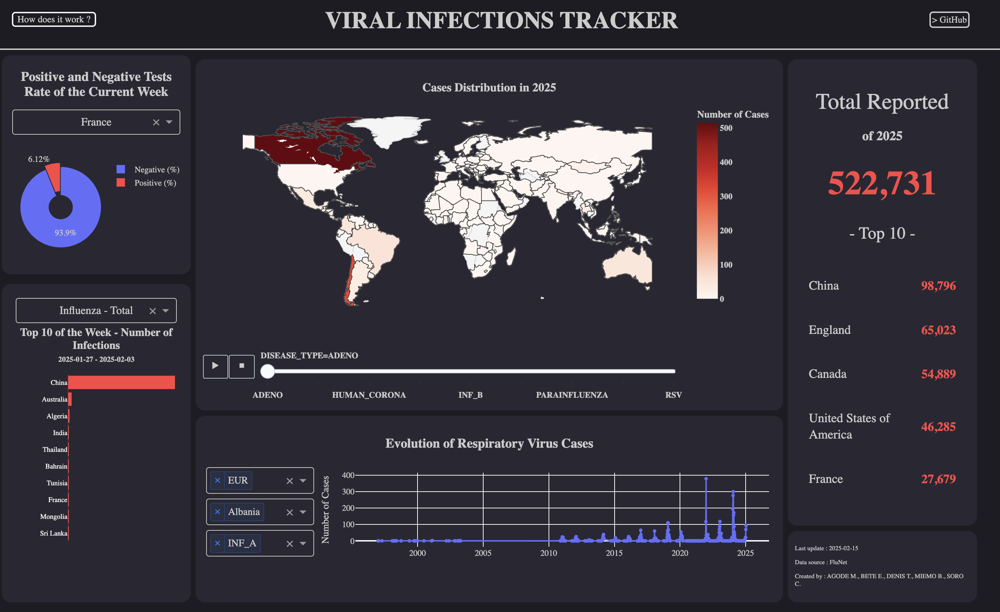

# 📊 Viral Respiratory Infections Dashboard
An interactive dashboard developed with Dash by Plotly, designed to visualize real-time epidemiological data on viral respiratory infections. The dashboard automatically updates every day through an automated scraper that retrieves, processes, and stores new data from the World Health Organization (WHO).

## Live Application
Explore the live dashboard here: **[https://virustracker.financeforge.fr/]**
⚠ If you receive a security warning after clicking the link, click on "Advanced settings" and then "Continue to said link"

## Dashboard Previews
**

## Project Overview
### Data Pipeline
This project features an automated pipeline that scrapes epidemiological data from WHO’s FluNet database and updates the dashboard daily. The key steps include:
- **Web Scraping:** A Python-based scraper fetches the latest data from WHO’s website.
- **Data Processing:** The raw data is cleaned and formatted to align with UN country naming conventions.
- **Storage:** The processed data is stored as a CSV file.
- **Dashboard Update:** The Dash app visualizes the most recent data for real-time insights.

### Automated Scraper
- Scrapes data daily from WHO’s FluNet portal.
- Uses Python libraries such as `requests`, `BeautifulSoup`, and `Pandas`.
- Appends new data to the existing dataset without overwriting past records.
- Runs automatically every day at 10:00 AM.

## Database Management
The dashboard relies on a structured and efficient data storage approach:
- The latest epidemiological data is stored in a **CSV-based database**, ensuring quick access and compatibility with Pandas.
- Data is appended incrementally to prevent duplication and data loss.
- A versioning mechanism ensures that previous datasets remain accessible for validation and potential corrections.
- The scraper updates only new records based on the latest available timestamp, preventing redundant entries and maintaining database integrity.
- Future enhancements may include migrating to a SQL or NoSQL database for more robust querying and analysis.

## Dash Application
The dashboard provides:
- Interactive maps showing infection spread.
- Bar charts highlighting top affected countries.
- Line graphs visualizing infection trends over time.
- Pie charts depicting test positivity rates.
- A user-friendly interface with a built-in help guide.

## Deployment on cPanel
Unlike cloud platforms like AWS or GCP, we deployed our Dash application on **cPanel**, a popular web hosting control panel. Here’s how the deployment process worked for us:

1. **Uploading Files:**
   - The entire project folder was uploaded to cPanel’s File Manager.
   - Included essential files: `app.py`, `scraping.py`, `requirements.txt`, `passenger_wsgi.py`, and `app.wsgi`.

2. **Setting Up the Python Environment:**
   - We configured a Python application in cPanel and installed the required dependencies using `pip install -r requirements.txt`.
   
3. **Handling Data Updates:**
   - The `scraping.py` script was set to run via a cron job in cPanel, ensuring daily updates to `data_flunet.csv`.
   - The scraper updates only new records, preventing data duplication.

4. **WSGI Configuration:**
   - A `passenger_wsgi.py` file was added to properly load the Dash application.
   - We encountered issues with the default app runner and had to explicitly specify the entry point:
     ```python
     from app import server as application

## Installation & Local Setup
To run the dashboard locally:
1. Clone the repository:
   ```sh
   git clone [repository-url]
   ```
2. Install dependencies:
   ```sh
   pip3 install -r requirements.txt
   ```
3. Run the application:
   ```sh
   python3 app.py
   ```

For cloud or alternative hosting setups, modify configurations accordingly.

---
This dashboard provides an insightful, automated view of viral respiratory infection trends, helping researchers and decision-makers analyze global epidemiological patterns in real time.

